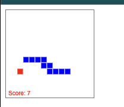

# reinforcement-learning-snake
This is a simple implementation of the snake game using reinforcement learning. The snake is trained using the Q-learning algorithm. The snake learns to play the game by itself. The snake is rewarded when it eats the food and penalized when it hits the wall or itself.

The entire project is implemented in vanilla JavaScript. No libraries are used for the neural network or the game itself: the matrix maths, the layers, backpropagation and gradient descent are all written from scratch so you can read how a neural network works under the hood. Open `index.html` in a browser to watch the snake learn.



## Structure

```
src/
  nn/         Neural network from scratch
    Matrix         flat row-major matrix: dot, hadamard, transpose, map...
    Activation     identity / ReLU / sigmoid / tanh and their derivatives
    DenseLayer     forward pass, backpropagation (chain rule), gradient descent step
    NeuralNetwork  stacks layers; predict() and train() (one SGD step)
    ModelStore     saves / loads the network as JSON in localStorage
  game/       Game rules and presentation
    Point, Direction (+ Action), Board, Snake, SnakeGame   pure domain model
    CanvasRenderer, KeyboardController                      I/O adapters
  rl/         Reinforcement learning
    StateEncoder         game -> observation vector
    EpsilonGreedyPolicy  exploration strategy
    ReplayMemory         ring buffer of Experience objects
    QTrainer             Bellman targets -> network.train()
    Agent                composes the pieces above
  training/
    TrainingSession      agent <-> game loop
    TrainingStats        record / mean score
  main.js     composition root (wires everything together)
```

## How the network learns
For one sample, `NeuralNetwork.train(input, target)`:
1. **Forward**: each layer computes `a = f(W·x + b)`.
2. **Loss**: `L = ½ Σ (output − target)²`, so `dL/doutput = output − target`.
3. **Backward**: each layer turns `dL/da` into `dL/dW`, `dL/db` and `dL/dx` (the chain rule) and passes `dL/dx` to the previous layer.
4. **Update**: every parameter moves against its gradient: `W ← W − learningRate · dL/dW`.

For Q-learning the target is the network's own prediction, except for the action taken, which is set to the Bellman value `reward + γ · max Q(next state)`.
